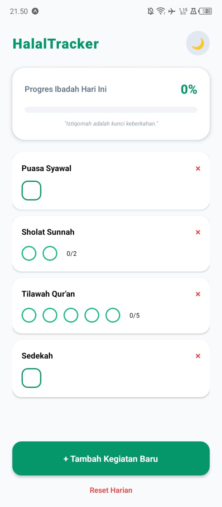
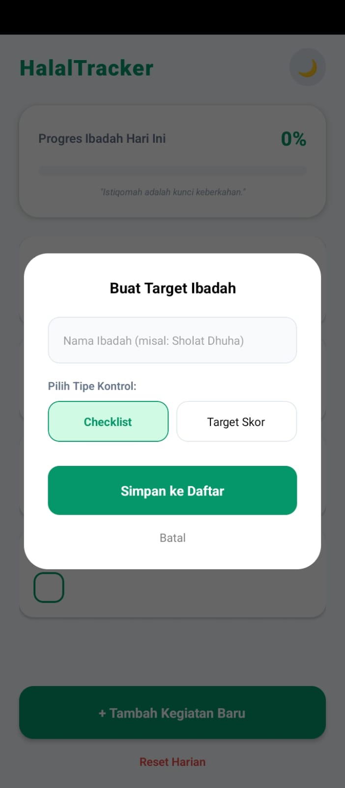
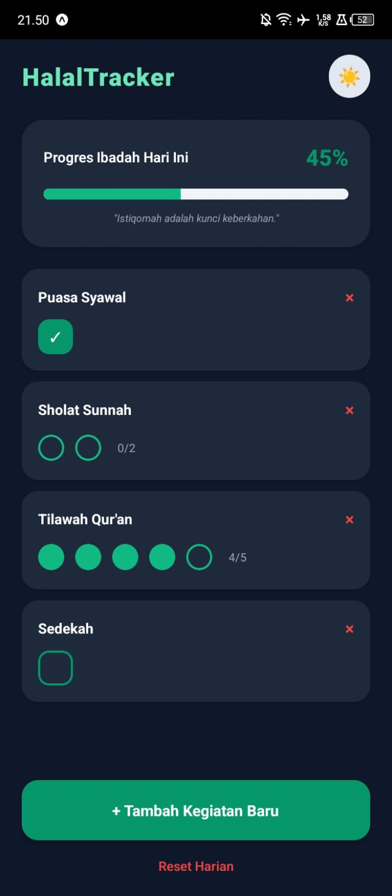

# HalalTracker - THR Minggu 4 State Management

## Informasi Mahasiswa
- Nama : Sultan Muhammad Fachlid Jakarai
- NIM : 2410501011
- Opsi : Opsi A - HalalTracker

## Deskripsi Aplikasi
HalalTracker adalah aplikasi pemantau ibadah harian yang dirancang khusus untuk menjaga konsistensi amalan di bulan Syawal. Aplikasi ini mendukung dua tipe kegiatan: Checklist tunggal dan Target Skor (Parsial). 

Fitur unggulan:
- Smart Progress: Menghitung progres harian secara akurat berdasarkan bobot amalan (Checklist bernilai 1, sedangkan Skor dihitung per poin yang diselesaikan).
- Auto-Daily Reset: Menggunakan logika perbandingan tanggal di AsyncStorage untuk meriset progres otomatis setiap berganti hari (00:00).
- Dynamic List: Pengguna dapat menambah, menghapus, atau mengurangi skor amalan secara fleksibel.
- Dark Mode: Mendukung kenyamanan visual bagi pengguna.

## Hooks yang Digunakan
- useState: Digunakan di `DashboardScreen` untuk mengelola visibilitas modal input, teks salam dinamis, dan kontrol tema (Dark/Light Mode).
- useEffect: Digunakan di `AmalanContext` untuk memuat data dari `AsyncStorage` saat startup dan menjalankan logika Auto-Reset harian dengan membandingkan timestamp tanggal.
- useReducer: Digunakan untuk mengelola state global `daftar` amalan dengan action types:
    - `TOGGLE_CEK`: Mengubah status selesai pada tipe checklist.
    - `UPDATE_SKOR`: Menambah atau mengurangi poin pada tipe skor.
    - `TAMBAH_BARU`: Menambahkan kegiatan kustom dari input user.
    - `HAPUS_ITEM`: Menghapus kegiatan dari daftar.
    - `RESET`: Membersihkan seluruh progres harian.
    - `MUAT`: Sinkronisasi data dari storage ke state.
- Custom Hook: `useHabits` (dalam file `useTracker.js`) berfungsi untuk mengabstraksi logika perhitungan progres matematika yang kompleks dan menyediakan fungsi aksi (`dispatch`) ke komponen UI agar kode lebih bersih (Clean Code).

## Screenshot
1. Tampilan Dashboard (Light Mode) 
2. Tampilan Tambah Ibadah Baru (Modal) 
3. Tampilan Progres & Dark Mode 

## Cara Menjalankan
1. Clone Repository ini.
2. Jalankan `npm install` untuk mengunduh library.
3. Jalankan `npx expo start` untuk memulai aplikasi.
